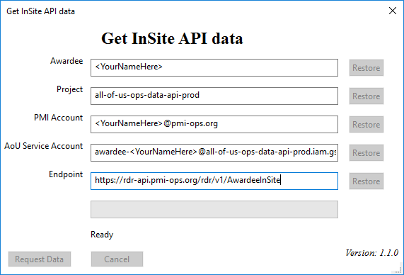
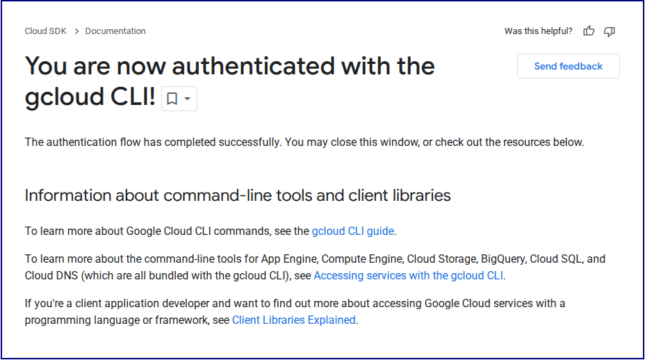

[](https://github.com/psf/black)


## Get My API Data
A GUI tool for querying All of Us participant data using the InSite API.



### Installation

1. Install [`gcloud tools`](https://cloud.google.com/sdk/docs/install)
2. Either:
    * Download the `.exe` version of this app from [GitHub](https://github.com/DBMI/GetMyApiData/releases/tag/v0.1-exe) and run `GetMyApiData.exe`
    * Or download the source code using ```git clone https://github.com/DBMI/GetMyApiData.git``` and–within the Python virtual environment–run ``__main__.py``


### Operation
Once you've inserted into the GUI your actual PMI account and service account information and selected the location for the `key.json` file, press `Request Data`.

The gcloud account selection page will appear:


... and request permission to access your account:


... and finally show you're authenticated:



Once the files have been downloaded, the app will ask you to specify a folder in which to save them. The folder will contain your participant list in both InSite format and transformed into the HealthPro format (to accommodate legacy code):


### Support
Contact Kevin J. Delaney at UC San Diego: <kjdelaney@health.ucsd.edu>
